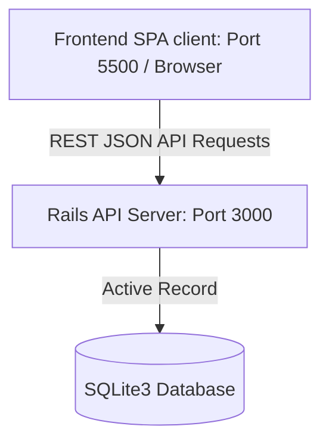

# TaskFlow — Decoupled SPA & Rails JSON API

TaskFlow is a premium, high-fidelity single-page to-do application designed to streamline daily tasks with sleek metrics dashboard visualizations, advanced filtering, and micro-animations.

The project is structured as a **decoupled architecture**:
* **`/frontend`**: A fast, responsive, and beautifully styled client SPA built with modern HTML5, vanilla HSL-color CSS (featuring custom glassmorphism and skeletons), and native JavaScript.
* **`/backend`**: An optimized, lightweight **Ruby on Rails 8** API-only server connected to a **SQLite3** database.

---

## Technical Stack & Architecture



### Frontend (`/frontend`)
* **Markup:** Semantic HTML5 structure.
* **Styling:** Vanilla CSS3 featuring custom dark mode palettes, harmony-curated colors, smooth hover micro-transitions, metrics dashboards, loading skeletons, and interactive modal dialogs.
* **Logic:** Plain JavaScript using the native `fetch` API to make non-blocking, asynchronous requests to the backend server.

### Backend (`/backend`)
* **Framework:** Ruby on Rails (v8.1+) configured in **API-only** mode (`config.api_only = true`).
* **Database:** SQLite3 with configured solid-cache, solid-queue, and solid-cable databases.
* **CORS Policy:** Enabled CORS using `rack-cors` to allow safe, decoupled local/remote REST API connections.
* **Endpoints:**
  * `GET /tasks` - Retrieve tasks (supports search query, status, priority, and category filters).
  * `GET /tasks/metrics` - Retrieve overall task progress and metadata summaries.
  * `POST /tasks` - Create a new task.
  * `PATCH /tasks/:id` - Update task details.
  * `DELETE /tasks/:id` - Delete a task.
  * `PATCH /tasks/:id/toggle` - Toggle task completion status.

---

## Local Setup Instructions

### Prerequisites
* Ruby (v3.3+)
* A browser to view the frontend index page.

### 1. Start the Backend Server
Navigate to the `backend/` directory:
```bash
# Verify migrations are up-to-date
ruby bin/rails db:migrate

# Start the Puma Rails server (runs on https://to-do-list-jet-five-44.vercel.app/ )
ruby bin/rails server
```
The API endpoint will be available .

### 2. Run the Frontend Client
You can open [frontend/index.html](file:///c:/Users/dasar/OneDrive/Desktop/To%20do/frontend/index.html) directly in any modern browser, or run a simple local web server:
```bash
# Example using Python to serve
cd frontend
python -m http.server 5500
```
Then open `http://127.0.0.1:5500/` in your browser.

---

## Deployment Guidelines

### Backend Deployment (Render, Heroku, or Fly.io)
1. Set the following environment variables:
   * `RAILS_ENV=production`
   * `RAILS_MASTER_KEY` (use the secret key from `backend/config/master.key`)
2. Run database migrations during the build/release phase:
   * `bundle exec rails db:migrate`
3. Configure persistent storage:
   * Ensure that the SQLite databases stored in `backend/storage/` are mapped to a persistent volume so task entries persist across deployments.

### Frontend Deployment on Vercel
1. **API Configuration**: Open [frontend/app.js](file:///c:/Users/Akshith/New%20folder/To-do-list/frontend/app.js) and set `API_BASE_URL` (or `window.API_BASE_URL`) to your deployed backend API URL (e.g., `https://your-backend.onrender.com`).
2. **Deploy via Vercel CLI**:
   ```bash
   # Login to Vercel CLI if needed
   npx vercel login

   # Deploy to preview
   npx vercel

   # Deploy to production
   npx vercel --prod
   ```
3. **Deploy via GitHub / Vercel Dashboard**:
   * Push your changes to GitHub.
   * Go to [Vercel Dashboard](https://vercel.com/new).
   * Import the repository.
   * Root Directory is pre-configured via [vercel.json](file:///c:/Users/Akshith/New%20folder/To-do-list/vercel.json) (`outputDirectory: "frontend"`).
   * Click **Deploy**.
